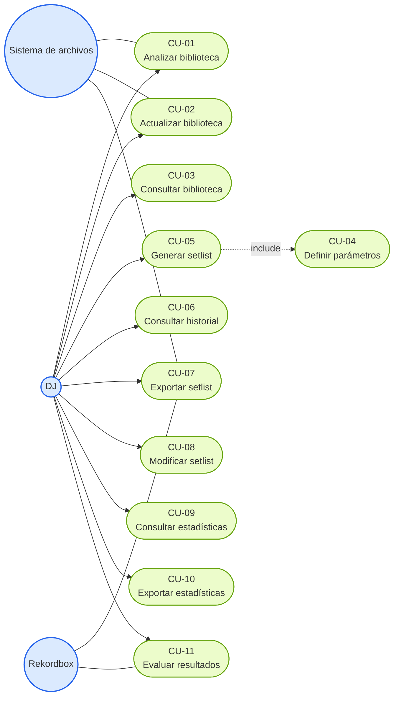

```mermaid
flowchart LR

    DJ((DJ))

    CU01([CU-01<br/>Analizar biblioteca])
    CU02([CU-02<br/>Actualizar biblioteca])
    CU03([CU-03<br/>Consultar biblioteca])
    CU04([CU-04<br/>Definir parámetros])
    CU05([CU-05<br/>Generar setlist])
    CU06([CU-06<br/>Consultar historial])
    CU07([CU-07<br/>Exportar setlist])
    CU08([CU-08<br/>Modificar setlist])
    CU09([CU-09<br/>Consultar estadísticas])
    CU10([CU-10<br/>Exportar estadísticas])
    CU11([CU-11<br/>Evaluar resultados])

    RB((Rekordbox))
    FS((Sistema de archivos))

    DJ --> CU01
    DJ --> CU02
    DJ --> CU03
    DJ --> CU05
    DJ --> CU06
    DJ --> CU07
    DJ --> CU08
    DJ --> CU09
    DJ --> CU10
    DJ --> CU11

    CU05 -. include .-> CU04

    FS --- CU01
    FS --- CU02
    FS --- CU07

    RB --- CU07
    RB --- CU11

    classDef actor fill:#dbeafe,stroke:#2563eb,stroke-width:2px;
    classDef usecase fill:#ecfccb,stroke:#65a30d,stroke-width:1.5px;

    class DJ,RB,FS actor;
    class CU01,CU02,CU03,CU04,CU05,CU06,CU07,CU08,CU09,CU10,CU11 usecase;
```
