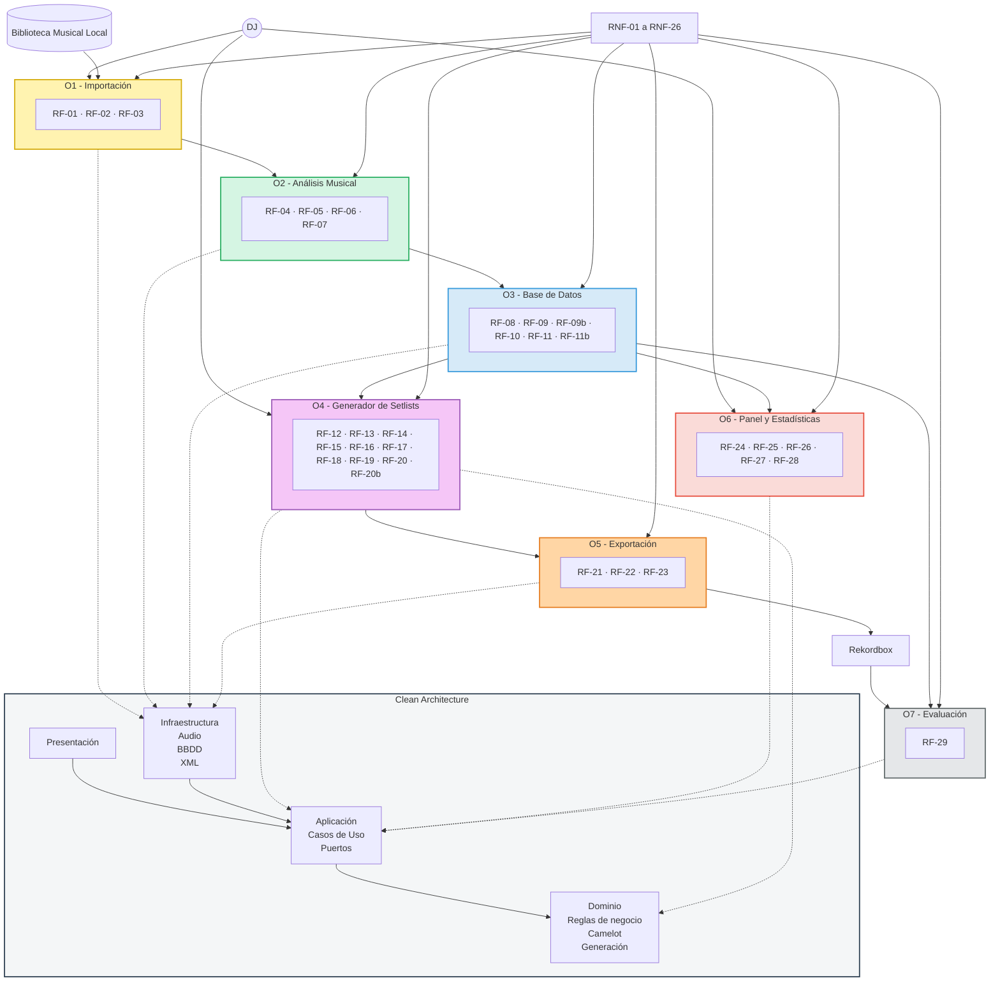

```mermaid
flowchart TB

    DJ((DJ))

    FS[(Biblioteca Musical Local)]
    RB[Rekordbox]

    subgraph O1["O1 - Importación"]
        RF1["RF-01 · RF-02 · RF-03"]
    end

    subgraph O2["O2 - Análisis Musical"]
        RF2["RF-04 · RF-05 · RF-06 · RF-07"]
    end

    subgraph O3["O3 - Base de Datos"]
        RF3["RF-08 · RF-09 · RF-09b · RF-10 · RF-11 · RF-11b"]
    end

    subgraph O4["O4 - Generador de Setlists"]
        RF4["RF-12 · RF-13 · RF-14 · RF-15 · RF-16 · RF-17 · RF-18 · RF-19 · RF-20 · RF-20b"]
    end

    subgraph O5["O5 - Exportación"]
        RF5["RF-21 · RF-22 · RF-23"]
    end

    subgraph O6["O6 - Panel y Estadísticas"]
        RF6["RF-24 · RF-25 · RF-26 · RF-27 · RF-28"]
    end

    subgraph O7["O7 - Evaluación"]
        RF7["RF-29"]
    end

    DJ --> O1
    DJ --> O4
    DJ --> O6

    FS --> O1

    O1 --> O2
    O2 --> O3

    O3 --> O4
    O3 --> O6

    O4 --> O5
    O5 --> RB

    RB --> O7
    O3 --> O7

    subgraph CA["Clean Architecture"]

        P["Presentación"]

        A["Aplicación
        Casos de Uso
        Puertos"]

        D["Dominio
        Reglas de negocio
        Camelot
        Generación"]

        I["Infraestructura
        Audio
        BBDD
        XML"]

        P --> A
        A --> D
        I --> A

    end

    O1 -.-> I
    O2 -.-> I
    O3 -.-> I

    O4 -.-> D
    O4 -.-> A

    O5 -.-> I

    O6 -.-> A

    O7 -.-> A

    RNF["RNF-01 a RNF-26"]

    RNF --> O1
    RNF --> O2
    RNF --> O3
    RNF --> O4
    RNF --> O5
    RNF --> O6
    RNF --> O7

    style O1 fill:#FFF3B0,stroke:#D4AC0D,stroke-width:2px
    style O2 fill:#D5F5E3,stroke:#27AE60,stroke-width:2px
    style O3 fill:#D6EAF8,stroke:#3498DB,stroke-width:2px
    style O4 fill:#F5C6F7,stroke:#9B59B6,stroke-width:2px
    style O5 fill:#FFD6A5,stroke:#E67E22,stroke-width:2px
    style O6 fill:#FADBD8,stroke:#E74C3C,stroke-width:2px
    style O7 fill:#E5E7E9,stroke:#616A6B,stroke-width:2px

    style CA fill:#F4F6F7,stroke:#2C3E50,stroke-width:2px
```
